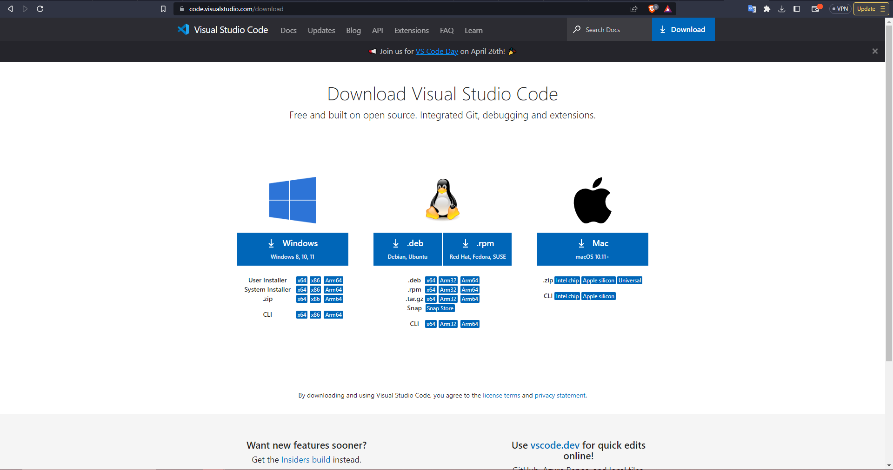
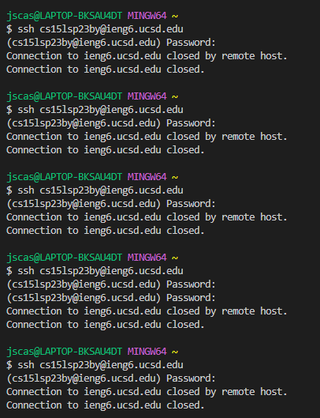
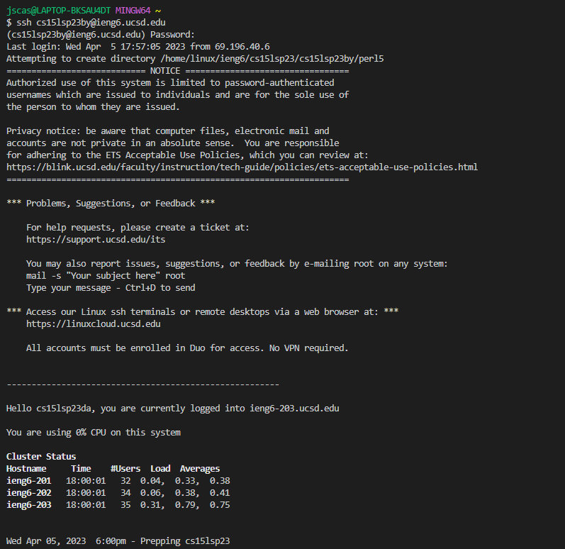
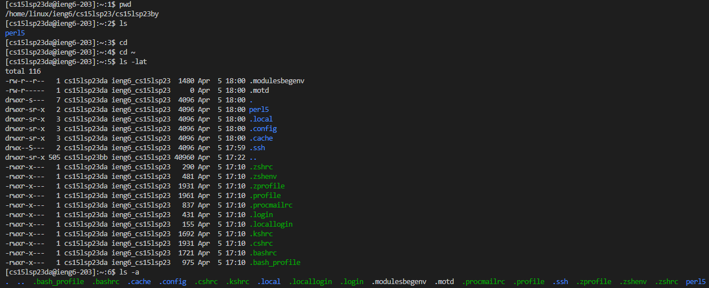

# Lab 1  
The first step is installing vscode onto the device, but I already had it installed from my previous cse11 class. Installing it is quite simple though, as you just go to the site (https://code.visualstudio.com/download) and download the correct file for your operating system. Once downloaded, just unzip the file and then run it, and just follow the installer's instructions and select launch when finished at the end.  
  
The second step is connecting remotely, which I struggled with quite a bit. You have to get your username and set your password, which was simple enough, but when it came to connecting I was getting disconnected by the host.  
  
After waiting around for 45 or so minutes, the connection finally worked and I was able to get into the interface.  
  
Finally, the third step was running commands remotely. I went and tried some of the listed commands, such as pwd, which showed me the directory of this remote server, and then ls, which returned perl5. I tried ls -lat which returned a lot of information back to me, which is quite hard to parse.  

