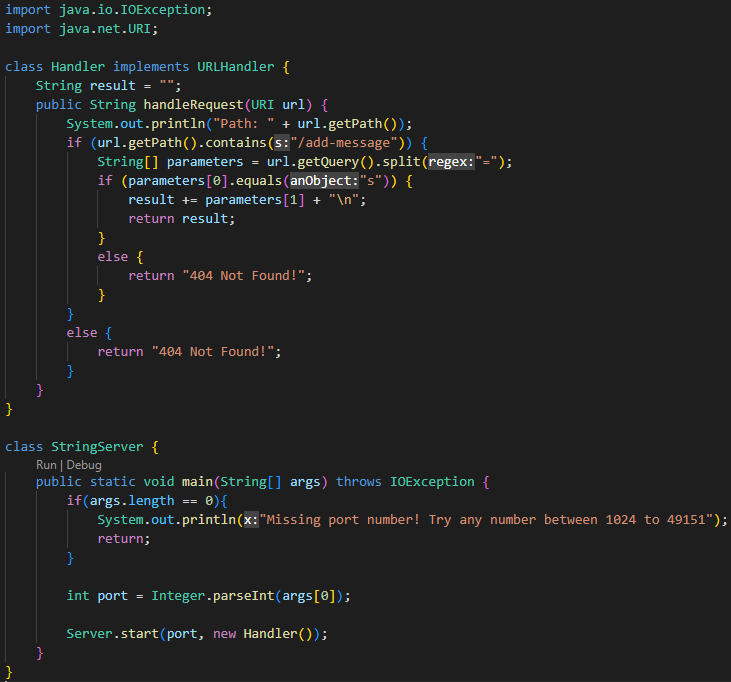
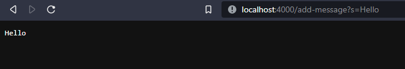
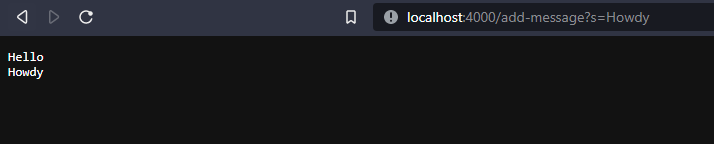
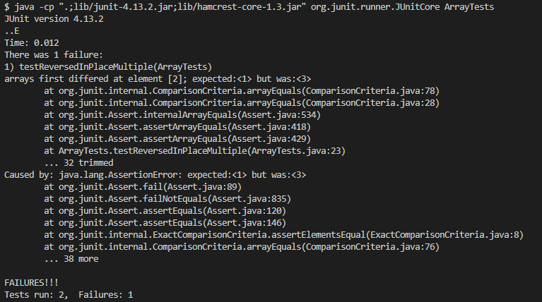

# Lab 2  
## Part 1  
  
  
First I started off with just adding Hello, which calls my handlerequest method. The input to this is a URI and is what determines what is added to the string output or whether a 404 error is called. Before calling the method, the result string is empty. After calling the method, the word "Hello\n" gets added to the result string. The handleRequest is being fed the URI of "localhost:4000/add-messsage?s=Hello".  
  
Next I replaced Hello with Howdy for my URI. This also calls the handleRequest method, but instead of starting off with an empty result string we start off with the previously added "Hello\n" and add onto it from there. After feeding "localhost:4000/add-messsage?s=Howdy" into the handleRequest method, we add "Howdy\n" onto the result string and return it once again. The result string is now "Hello\nHowdy\n".  
## Part 2  
I chose the ReverseInPlace method from the ArrayExamples file. A failure-inducing input for the program is  
~~~
@Test  
public void testReversedInPlaceMultiple() {  
	int[] input2 = {1,2,3};  
	ArrayExamples.reverseInPlace(input2);  
	assertArrayEquals(new int[]{ 3,2,1 }, input2);  
}  
~~~
  
An input that did not induce failure is  
~~~
@Test  
public void testReverseInPlaceSingle() {  
	int[] input1 = { 1 };  
	ArrayExamples.reverseInPlace(input1);  
	assertArrayEquals(new int[]{ 1 }, input1);  
}  
~~~
  
The output of these two tests is  
  
  
The buggy code before the fixes is  
~~~
static void reverseInPlace(int[] arr) {
	for(int i = 0; i < arr.length; i += 1) {
		arr[i] = arr[arr.length - i - 1];
	}
}
~~~
The code after the fixes is  
~~~
static void reverseInPlace(int[] arr) {
	int[] temp = new int[arr.length];
	for(int i = 0; i<arr.length; i++){
		temp[i] = arr[i];
	}
	for(int i = 0; i < arr.length; i += 1) {
		arr[i] = temp[temp.length - i - 1];
	}
}
~~~
## Part 3  
Something new that I found really interesting was that you could run your sites using the ieng6 server and have other people get onto it. I always knew that you could do it in theory (since I use the internet all the time) but actually learning how to do it seems pretty useful, especially since it was so easy to do. I feel like the things we've learned about servers and how to set them up has probably been the most applicable to the real world out of all of my CS education here so far.
